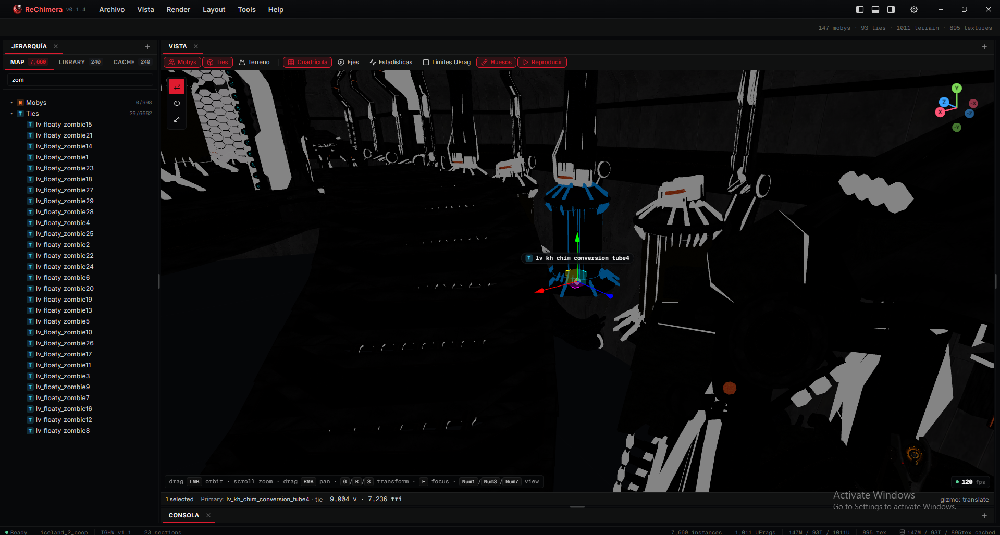

<p align="center">
 
</p>

<h1 align="center">ReChimera</h1>

<p align="center">
 <strong>Offline level inspector and asset extractor for Insomniac Games' PS3 titles</strong><br/>
 <sub>Resistance: Fall of Man · Resistance 2 · Resistance 3 · Ratchet &amp; Clank: Tools of Destruction · Full Frontal Assault · All 4 One</sub>
</p>

<p align="center">
 <a href="#status"></a>
 <a href="LICENSE"></a>
</p>

<p align="center">
 <a href="https://www.rust-lang.org"></a>
 <a href="https://tauri.app"></a>
 <a href="https://react.dev"></a>
 <a href="https://threejs.org"></a>
</p>



---

ReChimera loads a level folder from disk, decodes its meshes, textures,
skeletons, animations, and sound banks, and lets you preview / export them
through a desktop UI. It's a clean-room reimplementation in **Rust + Tauri 2 +
React + Three.js**, ported from the file-format research maintained by the
Insomniac modding community (see [Acknowledgements](#acknowledgements)).
No game data is shipped — only format readers and a viewer. **Use it on game
files you legally own.**

> For architecture, parser internals, build scripts, headless dumpers and
> contributor notes, see the [`docs/`](docs/) folder. The same content is
> also available **inside the app** under **Help → Documentation**.

## How this app was built

Built with **[Claude Code](https://claude.com/claude-code)** paired with
the developer experience of [Pablo Cabrera
Castrejón](https://github.com/Mrroboto9819), on top of the format work
done by **[Lunacy](https://github.com/NefariousTechSupport) /
[ReLunacy](https://github.com/VELD-Dev/ReLunacy)** (originally by
[@NefariousTechSupport](https://github.com/NefariousTechSupport),
maintained today by [@VELD-Dev](https://github.com/VELD-Dev)) and
**[InsomniaToolset](https://github.com/PredatorCZ/InsomniaToolset)** (by
[@PredatorCZ](https://github.com/PredatorCZ)). ReChimera is a port and
a viewer — see [Acknowledgements](#acknowledgements) for the full
dependency / reference list.

---

## Before you start

A level needs **every `.psarc` that ships with it extracted into the
same folder**. The parser walks `assetlookup.dat` and expects its
siblings (`mobys.dat`, `ties.dat`, `shaders.dat`, `textures.dat`,
`highmips.dat`, `animsets.dat`, `zones.dat`, plus the level's
`resident_*.dat` / `streaming_*.dat` audio companions) to live in the
same directory. Use any PSARC extractor — including the **Extract a
PSARC** flow built into ReChimera — and point every archive at one
common output folder. Missing siblings surface as `no audio` badges or
empty meshes; they don't crash the loader.

## What it does

- Browse a level folder by pointing at any directory containing `assetlookup.dat`.
- 3D viewport (Three.js) with orbit / pan / zoom, selection gizmos, hierarchy panel.
- Per-instance Inspector with a live mini 3D preview, transform editing, and "Go to" framing.
- Texture decode (DXT1/3/5 + Morton-swizzled R5G6B5/A8R8G8B8) with inline previews.
- Skinned-mesh rigs with per-animset clip playback; pick any clip to override on a character.
- Sound banks (V1 RFOM + V2 R2/R3/RCF SCREAM), VAGp / VPK / XVAG decoders, in-app player + WAV export.
- Asset Library tree with a per-asset preview modal that renders straight from cache.
- GLB export with bones, skinning weights, materials, textures, and selectable animations from any animset in the level.
- PSARC list + extract.

## Supported games

| Game | Layout | IGHW | SCREAM | Mesh | Tex | Skel | Anim | Terrain | Notes |
|---|---|---|---|---|---|---|---|---|---|
| Resistance: Fall of Man | `ps3levelmain.dat` | v1.1 | V1 | yes | yes | yes | yes | ufrags + foliage + shrubs + sky | extract `game.psarc` first |
| Resistance 2 | `assetlookup.dat` (V2) | v1.1 | V2 | yes | yes | yes | yes | ufrags | tested end-to-end |
| Resistance 3 | `assetlookup.dat` (V2) | v1.1 | V2 | yes | yes | yes | yes | ufrags | tested end-to-end |
| R&C: Tools of Destruction | `main.dat` (TOD) | v1.1 | V2 | yes | yes | yes | T-pose | ufrags + tie instances (no sky) | pair-frame encoding RE'd for simple anims; complex (n8>0) format unsolved → T-pose. Zone reader, per-axis tie scale, materials all ship. Skybox not supported — no IT/ReLunacy reference. |
| R&C: Full Frontal Assault | `assetlookup.dat` (V2) | v1.1 | V2 | yes | partial | yes | yes | ufrags | a few textures still missing |
| R&C: All 4 One | `assetlookup.dat` (V2) | v1.1 | V2 | yes | yes | yes | yes | ufrags | tested |

---

## Installation

Builds are produced for all three desktop platforms.

| Platform | Format | Build status | Tested? | Auto-update |
|---|---|---|---|---|
| Windows 10 / 11 (x86_64) | `.msi` + portable `.exe` | yes | yes | Built-in |
| Linux (x86_64) | `.AppImage` + `.deb` | yes | untested | Manual — download new release from GitHub |
| macOS 12+ (Apple Silicon + Intel) | `.dmg` | yes | untested | Manual — download new release from GitHub |

When a new version is available the app shows an **Update** button:
- **Windows**: clicking it downloads + installs in place and relaunches.
- **macOS / Linux**: clicking it opens [the GitHub Releases page](https://github.com/Mrroboto9819/ReChimera/releases/latest); replace the binary manually.

Releases live at <https://github.com/Mrroboto9819/ReChimera/releases>.

---

## Developers

**Toolchain**

| Tool | Required version |
|---|---|
| **Rust** | 1.75+ (`rustup default stable`). Edition 2021. Workspace `rust-version = "1.75"`. |
| **Cargo** | ships with rustup |
| **WebView2** | Windows 11 pre-installed; Windows 10 install from Microsoft |
| **Node-compatible package manager** | [Bun](https://bun.sh) (recommended) or `npm` 10+ |

**Run from source**

```sh
cd apps/desktop

# pick one — they're interchangeable for these scripts
bun install # or: npm install

bun run tauri:dev # or: npm run tauri:dev
```

`tauri:dev` builds the Rust backend, starts Vite on `localhost:1420`,
and opens the desktop window with hot-reload (TS / CSS reload
instantly, Rust changes need a `Ctrl+C` and re-run).

**Build a release bundle**

```sh
cd apps/desktop
bun run tauri:build # or: npm run tauri:build
```

Outputs `.msi` + portable `.exe` on Windows, `.AppImage` + `.deb` on
Linux, `.dmg` on macOS, into `apps/desktop/src-tauri/target/release/bundle/`.

**Headless parser dumpers** (no UI — handy for sanity-checking a parse
against a real file without booting the app):

```sh
# Container & top-level lookups
cargo run -p lunalib --example dump_assetlookup -- "<level-folder>/assetlookup.dat"

# Per-asset content
cargo run -p lunalib --example dump_moby_meshes -- "<level-folder>"
cargo run -p lunalib --example dump_moby_skin -- "<level-folder>" [--first N]
cargo run -p lunalib --example dump_tie_meshes -- "<level-folder>"
cargo run -p lunalib --example dump_shaders -- "<level-folder>"
cargo run -p lunalib --example dump_textures -- "<level-folder>" [output_dir] [max_pngs]

# Animation
cargo run -p lunalib --example dump_animsets -- "<level-folder>" [--decode N]

# Level-scope: terrain, zones, gameplay placements
cargo run -p lunalib --example dump_zones -- "<level-folder>"
cargo run -p lunalib --example dump_ufrags -- "<level-folder>"
cargo run -p lunalib --example dump_gameplay -- "<level-folder>"
```

All ten examples build under `cargo build -p lunalib --examples` and
read the same `<level-folder>` your app would. They auto-detect engine
era (V2 / RFOM / TOD) via [`level_layout.rs`](crates/lunalib/src/level_layout.rs)
so the same command works against every supported game.

For the architecture, parser internals, and the full IT / ReLunacy
cross-references, see [`docs/`](docs/) — the same content is
available inside the running app under **Help → Documentation**.

---

## Status

### Shipped
- IGHW container + asset parsers (mobys, ties, skeletons, animsets, textures, shaders, zones, gameplay).
- SCREAM V1/V2 sound banks + VAGp / VPK / XVAG stream decoders, in-app player, WAV export.
- **Sound tab categorisation** — SFX / Dialog / Music sub-tabs in the cache library, with counts per category.
- PSARC list + extract (plus an in-wizard PSARC extraction step).
- **Wizard franchise tabs** — Resistance / Ratchet & Clank tab strip at the top of step 1, with persisted selection.
- 3D viewport, hierarchy, inspector, asset library, sound player.
- Cache library: per-level cache writes one `.glb` per moby/tie; exports use this directly.
- **RFOM vegetation** — Shrub (mesh) and Foliage (branch + sprite quads) extraction with viewport toggles and dedicated colors.
- **RFOM detail clusters** — small static debris surfaced as their own asset type with hierarchy + Settings color.
- **RFOM skybox** — dome geometry extracted as GLB/OBJ/PLY, texture rendered as viewport background.
- **RFOM viseme rigs** — soldier / cartwright / Winters head clips now animate correctly (was producing collapsed-to-origin bones before the `swap & 0x1F` shift-mask fix).
- **TOD level pipeline** — Tools of Destruction now extracts ties (all 142 entries, was failing at 81+ due to a `vbuf_size` over-allocation in the header), per-axis tie scale applied per-vertex, zone reader (3790 tie instances + 5410 ufrag terrain pieces on stratus city), shaders/materials/textures, mobys with skeletons and weights. Animations export as T-pose pending full RE.
- **TOD pair-frame anim encoding** — discovered TOD stores simple anims (n8=0) as (zero-filler, real-keyframe) pairs at half the apparent rate; complex anims (n8>0, the i8-delta path) remain unsolved and are shipped as T-pose to avoid visibly broken motion.
- **Materials / Normalmaps / Textures phase split** — texture extraction in the cache modal now shows three sequential progress bars (Materials → Normal maps → Textures) instead of one monolithic bar. Each unique PNG written exactly once, deduped via written set. Works for V2 / RFOM / TOD uniformly.
- **Real progress counts** — mobys/ties phases now show real counts (`170/170`) instead of the `123/1` placeholder. Added `_with_total` variants of the TOD/RFOM streaming readers to expose the section count upfront.
- **Toolbar info expanded** — status bar now shows distinct `(albedo, normal, emissive)` material count and total animation clip count alongside the existing mobys/ties/terrain/textures counts.
- **Full-map GLB export upgrade** — bakes mobys + ties + details + shrubs + foliage + terrain + skybox dome into a single drag-into-Godot/Blender file.
- GLB export — bones, weights, materials, textures, multi-mesh layout, selectable animations from any animset.
- Animation picker burger menu on the GLB preview — play any clip on the current rig, tick clips for export.
- Multi-step Export modal — scope toggles (mesh / materials+textures / armature) + texture quality presets (Low/Medium/High/Original) + animation picker.
- **Methodology doc + skills** — `docs/internal/lunalib-and-IT/09-debugging-methodology.md` and `/insomnia-toolset` / `/relunacy` skills cover the probe → log → re-extract loop for porting unknown formats.

### In progress
- Sound playback verification on R2 / R3 / RCF.
- MPEG-encoded XVAG decode (currently errors cleanly).

### Roadmap (next patches)
- **R&C: Tools of Destruction complex animations (n8>0)**. Pair-frame encoding for simple anims (`animate_spin`, doors, fills) is now RE'd and works, but the i8 delta-track encoding used by ~95% of TOD content (character idles, attacks, walks) remains unsolved. Applying the IT-style decoder produces wild bone displacement, so we ship T-pose. Needs raw-byte probing of the i8 region across a known-correct anim to crack the encoding. Probe scaffold lives in `cache.rs::probe_anim_bytes` + `[tod-trans-probe]`.
- **TOD collision geometry** (`collision.dat`). Separate file in every TOD level folder — not currently parsed. Format unknown to us, no IT/ReLunacy reference. Would unlock Godot/Unity import with proper collision volumes instead of mesh-derived approximations.
- **TOD lighting / environment data**. TOD has dynamic lighting in-game, but the section IDs that hold light placements aren't identified yet. RFOM's lighting sections are in different section IDs and ReLunacy doesn't cover this for TOD.
- **TOD skybox — not supported.** Unlike RFOM (which has a dedicated dome decoder shipping this round), TOD's sky data has no working reference: IT has no TOD decoder at all, and we audited every ReLunacy branch (`master`, `dev`, `bliss`, `bliss-old-loader`) — only an unused stub exists in `dev`, no section IDs identified, no rendering path. Until a reference surfaces or someone probes the format, TOD levels render with no sky background and the cache produces no `skybox/` folder.
- **RFOM real lights**. The previously-labeled "lights" section (`0xC200`) was Foliage; no actual light section is identified yet. Candidates `0x14300` (404 × 64B) and `0x14B00` (408 × 64B) are unmapped instance tables — possibly lights, possibly trigger volumes. Needs raw-byte probing with `RECHIMERA_LOG_PROBES=1` on a real level.
- **RFOM gameplay placements beyond mobys** (triggers / volumes / spawns / paths / sound emitters / dynamic lights). IT has the `GameplayInstances` struct but its `other[6]` sub-arrays have **no struct definitions** in IT — would require RFOM debug-symbol reverse-engineering. Probe scaffold lives in `gameplay_rfom.rs` and dumps raw bytes when `RECHIMERA_LOG_PROBES=1`.
- **RFOM collision**. No IT reference exists — Godot users can auto-generate collision from GLB geometry as a workaround for now.
- World repackaging — write edited transforms back to disk.
- Bulk exporters (textures, sounds, meshes, animations).
- Cross-platform build verification (macOS + Linux).
- Headless `rechimera-cli` for batch jobs without WebView2.
- Built-in PSARC repacker.

---

## Acknowledgements

ReChimera builds on years of community reverse-engineering on Insomniac's PS3 engine.

### People
- **[@VELD-Dev](https://github.com/VELD-Dev)** — author of [ReLunacy](https://github.com/VELD-Dev/ReLunacy) (the C# / Unity predecessor this project ports its core parser approach from) and lead maintainer here.
- **[@NefariousTechSupport](https://github.com/NefariousTechSupport)** — original developer of Lunacy and one of the key reverse engineers for these titles. ReChimera's renderer is directly inspired by their [7th igRewrite](https://github.com/NefariousTechSupport/7thigRewrite).
- **[@PredatorCZ](https://github.com/PredatorCZ)** — author of [InsomniaToolset](https://github.com/PredatorCZ/InsomniaToolset) and the [Spike framework](https://github.com/PredatorCZ/Spike). Many section IDs and struct layouts here come from cross-referencing their headers.
- **[@Nooga](https://github.com/Nooga)** — artist behind ReLunacy's logo, which set the visual identity this project follows.

### Reference projects
- **[ReLunacy / LibLunacy](https://github.com/VELD-Dev/ReLunacy)** (GPL-3.0) — the C# / Unity predecessor this project ports from.
- **[InsomniaToolset](https://github.com/PredatorCZ/InsomniaToolset)** (GPL-3.0) — canonical reference for the new-engine path (R2 / R3 / RCF).
- **[Spike framework](https://github.com/PredatorCZ/Spike)** (BSD-3-Clause).
- **[7th igRewrite](https://github.com/NefariousTechSupport/7thigRewrite)**.

All runtime dependencies are GPL-3.0-compatible. The full list lives in [`docs/`](docs/).

---

## License

This project is licensed under **GPL-3.0-or-later**. See [LICENSE](LICENSE) and [NOTICE.md](NOTICE.md). The licence is dictated by upstream — InsomniaToolset and ReLunacy / LibLunacy are GPL-3.0, and that propagates into derivative works.

**Game data is not included.** ReChimera ships only format readers and a viewer. You must supply your own legitimately-acquired game files.
