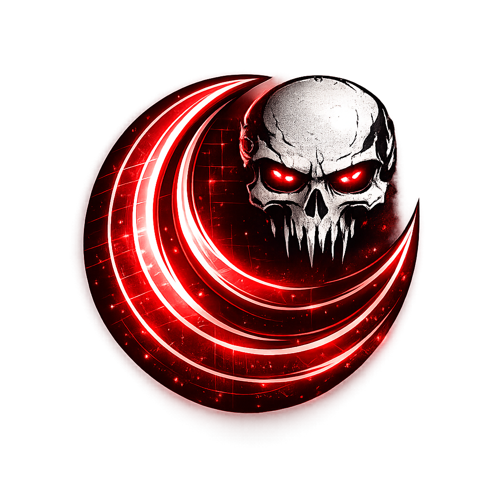
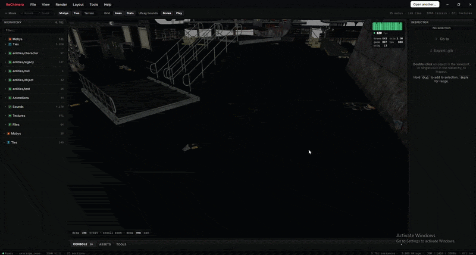

<p align="center">
  
</p>

<h1 align="center">ReChimera</h1>

<p align="center">
  <strong>Offline level inspector and asset extractor for Insomniac Games' PS3 titles</strong><br/>
  <sub>Resistance: Fall of Man · Resistance 2 · Resistance 3 · Ratchet &amp; Clank Future trilogy</sub>
</p>

<p align="center">
  <a href="#status"></a>
  <a href="#status"></a>
  <a href="LICENSE"></a>
</p>

<p align="center">
  <a href="#installation"></a>
  <a href="#installation"></a>
  <a href="#installation"></a>
</p>

<p align="center">
  <a href="https://www.rust-lang.org"></a>
  <a href="https://tauri.app"></a>
  <a href="https://react.dev"></a>
  <a href="https://threejs.org"></a>
  <a href="https://www.typescriptlang.org"></a>
</p>



---

ReChimera loads a level folder straight from disk, decodes its meshes, textures,
skeletons, animations, and sound banks, and lets you preview / export them
through a desktop UI.

It's a clean-room reimplementation in **Rust + Tauri 2 + React + Three.js**,
ported from the file-format research and reference parsers maintained by the
Insomniac modding community (see [Acknowledgements](#acknowledgements)).
None of the original assets, executables, or proprietary tooling are
distributed — only format readers and a viewer. **Use it on game files you
legally own.**

> ⚠️ **Beta**: format coverage is still expanding and parser bugs do happen.
> Self-diagnostic dumps are wired into every failure path so issues surface
> in the Console instead of crashing — paste the dump if something looks
> wrong and it usually pinpoints the problem in seconds.

---

## What it does

- **Browse a level folder** — point at any directory containing
  `assetlookup.dat` and ReChimera scans every file it recognises.
- **Render the world in 3D** — a Three.js viewport with orbit / pan / zoom,
  selection gizmos (translate / rotate / scale), grid + axes overlays, and an
  IDE-style hierarchy panel listing every moby / tie / terrain UFrag.
- **Inspect assets** — per-instance Inspector with a live mini 3D preview,
  full transform fields editable inline, and a "Go to" button that re-frames
  the main viewport on the selected instance.
- **Decode textures** — handles DXT1 / DXT3 / DXT5 plus the Morton-swizzled
  R5G6B5 / A8R8G8B8 PS3 formats. Inline thumbnail previews from the
  Hierarchy's Textures section; bulk fetch via Tauri 2 binary IPC.
- **Skeleton + animation** — per-moby skinned-mesh rigs with bind-pose
  + per-animset clip playback. The Hierarchy's Animations section overrides
  any skinned character's clip on demand.
- **Decode sound banks** — V1 (RFOM) and V2 (R2/R3/RCF) SCREAM banks. Plays
  in-bank PS-ADPCM sounds, paired streaming containers (VAGp / VPK / XVAG
  PS-ADPCM), and orphan streaming files via brute-force header scanning. A
  bottom-of-app SoundPlayer with scrub / volume / export-to-WAV.
- **Asset Library tree** — every moby / tie referenced by `assetlookup.dat`
  organised by its path-style name (entities/character/weapon/sawgun, …),
  with a per-asset preview modal that opens directly from the tree.
- **GLB export** — the selection (or any single library asset) exports to
  glTF 2.0 binary with bones + skinning weights + animations baked as
  Blender NLA Actions.
- **PSARC tools** — list and extract PlayStation Archive files directly,
  with per-entry progress reporting.

## Supported games

| Game | IGHW version | SCREAM version | Status | Notes |
|---|---|---|---|---|
| Resistance: Fall of Man | v0.2 / v1.1 | V1 | ⚠️ Needs testing | `ps3sound.dat`, `ps3dialogue*.dat` |
| Resistance 2 | v1.1 | V2 | ✅ Tested | `resident_sound.dat`, paired or orphan streams |
| Resistance 3 | v1.1 | V2 | ✅ Tested | Same as R2 |
| Ratchet & Clank Future trilogy | v1.1 | V2 | ⚠️ Needs testing | Tools of Destruction, A Crack in Time, Quest for Booty |

What works depends entirely on whether your extracted level folder includes
the dependent files (e.g. dialogue banks need their `streaming_dialogue.*.dat`
siblings to be playable). The Hierarchy marks unreachable entries with a
"no audio" badge so the difference is visible.

---

## Architecture

```
ReChimera/
├── Cargo.toml                  # virtual workspace
├── crates/
│   ├── lunalib/                # core parser library (Rust)
│   │   ├── igfile.rs           # IGHW container reader (v0.2 + v1.1, BE/LE)
│   │   ├── stream.rs           # endian-aware byte reader
│   │   ├── assetlookup.rs      # asset-table master index
│   │   ├── moby.rs / tie.rs    # geometry + skinning decoders
│   │   ├── texture.rs          # DXT + Morton + bulk parallel PNG encode
│   │   ├── skeleton.rs         # bone hierarchy + bind pose
│   │   ├── animation.rs        # animset clips + per-frame keyframes
│   │   ├── shader.rs           # material → texture id lookups
│   │   ├── zone.rs / ufrag.rs  # streaming terrain
│   │   ├── gameplay.rs         # placed instances + transforms
│   │   ├── sound.rs            # V1/V2 SCREAM bank + VAGp/VPK/XVAG decoders
│   │   └── examples/           # CLI dumpers for headless verification
│   └── psarc/                  # PSARC archive reader (ZLIB only for now)
└── apps/
    └── desktop/                # Tauri 2 + Vite + React + TypeScript
        ├── src-tauri/          # Rust backend — Tauri commands wrap lunalib
        │   └── src/main.rs     # ~50 commands: open_level, level_meshes_stream,
        │                       # extract_level_sounds, dump_sound_bank, …
        └── src/                # React frontend
            ├── Viewport.tsx    # main 3D viewport (Three.js / R3F)
            ├── Hierarchy.tsx   # tree of mobys / ties / library / sounds / …
            ├── Inspector.tsx   # selection details + transform editing
            ├── SoundPlayer.tsx # bottom transport bar
            ├── GltfCharacterModal.tsx + RawCharacterModal.tsx
            └── api.ts          # typed wrappers around `invoke()`
```

**Frontend ↔ backend boundary** uses Tauri 2 IPC. Heavy binary payloads
(textures, mesh buffers) bypass JSON via the binary-IPC `Response` type to
avoid the base64 round-trip — see `get_level_textures_bulk` for the bulk
fetch pattern.

---

## Installation

### Release builds — *coming soon*

Pre-built installers for the three desktop platforms are being prepared.
The plan is **download → install → open the app** — no toolchain, no
build step.

| Platform | Format | Status |
|---|---|---|
| 🪟 Windows 10 / 11 (x86_64) | `.msi` installer + portable `.exe` | 🚧 in progress |
| 🐧 Linux (x86_64) | `.AppImage` + `.deb` | 🚧 in progress |
| 🍎 macOS 12+ (Apple Silicon + Intel) | `.dmg` (signed if Apple Dev account is set up, otherwise notarized-on-first-run) | 🚧 in progress |

Tauri 2 already cross-bundles for all three out of the box — what's
left is CI for reproducible release artifacts, code-signing on Windows
+ macOS, and a simple "first-run" updater. Track progress on the
project's GitHub Releases page; the first tagged release will land
when the SCREAM playback verification on R2 / R3 / RCF is signed off
and the world-repackaging spike (see [Roadmap](#roadmap-in-scope))
has at least a read-only round-trip.

### Run from source — *available today*

Until installers ship, build and run locally — see [Building &
running](#building--running) below. Tauri's dev workflow is fast: the
first compile is ~1–2 min, every subsequent edit hot-reloads.

---

## Building & running

**Prerequisites**
- Rust 1.75+ (`rustup default stable`)
- [Bun](https://bun.sh) (Node-compatible package manager)
- WebView2 (Windows 11: pre-installed; Windows 10: install from Microsoft)

**Dev mode (hot-reload)**
```sh
cd apps/desktop
bun install            # one-time
bun run tauri:dev      # launches the desktop app with Vite hot-reload
```

The first build takes ~1–2 min as the Tauri stack compiles. After that:
- TypeScript / CSS changes hot-reload instantly.
- Rust changes need a `Ctrl+C` and re-run of `tauri:dev`.

**Headless dumpers** (no UI, useful for sanity-checking a parser change)
```sh
cargo run -p lunalib --example dump_assetlookup -- "<path>/assetlookup.dat"
cargo run -p lunalib --example dump_textures    -- "<path>"
cargo run -p lunalib --example dump_moby_meshes -- "<path>"
```

**Release build**
```sh
cd apps/desktop
bun run build
cd ../..
cargo build -p rechimera-desktop --release
```

---

## Acknowledgements

ReChimera stands on the shoulders of years of community reverse-engineering on
Insomniac's PS3 engine. None of this would be possible without the people
below — heartfelt thanks for the format research, the open code, the help,
and the art.

### People

- **[@VELD-Dev](https://github.com/VELD-Dev)** — author of
  **[ReLunacy](https://github.com/RatchetModding/ReLunacy)** (the C# /
  Unity predecessor that ReChimera ports its core parser and rendering
  approach from) and the lead maintainer of this repository. Most of the
  format-decode pipeline you see here started as a port of work originally
  written by them.
- **[@NefariousTechSupport](https://github.com/NefariousTechSupport)** —
  original developer of **Lunacy**, the project that started all of this,
  and one of the key reverse engineers for the PS3-era Insomniac titles.
  ReChimera's renderer is **directly inspired by their
  [7th igRewrite](https://github.com/NefariousTechSupport/7thigRewrite)**, a
  level editor for Skylanders that pioneered a lot of the rendering
  patterns this project reuses.
- **[@PredatorCZ](https://github.com/PredatorCZ)** (Lukas Cone) — one of
  the pioneers of Ratchet & Clank: Future-series reverse engineering and
  the author of **[InsomniaToolset](https://github.com/PredatorCZ/InsomniaToolset)**
  + the **[Spike framework](https://github.com/PredatorCZ/Spike)**. A
  great many of the section IDs, struct layouts, and pointer-resolution
  rules in this codebase come from cross-referencing their headers in
  `common/include/insomnia/classes/` against real files.
- **[@Nooga](https://github.com/Nooga)** — artist behind **ReLunacy's
  logo**, which set the visual identity that this project's branding
  follows.

### Reference projects (the codebases we ported from)

- **[ReLunacy](https://github.com/RatchetModding/ReLunacy)** /
  **LibLunacy** — GPL-3.0, by [@VELD-Dev](https://github.com/VELD-Dev).
  The C# / Unity-based predecessor that this project descends from.
  ReChimera's IGHW container reader, endian detection, asset-lookup
  walkers, and texture-decode path (DXT + Morton inverse) port directly
  from `IGFile.cs`, `AssetLoader.cs`, `Texture.cs`, etc.
- **[InsomniaToolset](https://github.com/PredatorCZ/InsomniaToolset)** —
  GPL-3.0. The canonical reference for the new-engine path (R2 / R3 /
  RCF trilogy). The SCREAM V1/V2 detection, VAGp / VPK / XVAG decoders,
  and SoundStreams pointer-table format all come from
  cross-referencing their `extract_sound.cpp` and class definitions.
- **[Spike framework](https://github.com/PredatorCZ/Spike)** —
  BSD-3-Clause. Powers InsomniaToolset's reflective struct loading; we
  reimplement equivalent pointer-resolution logic in Rust per-struct
  rather than depending on the framework directly.
- **[7th igRewrite](https://github.com/NefariousTechSupport/7thigRewrite)** —
  the Skylanders level editor whose viewport / scene-graph design
  influenced ReChimera's renderer.

### Runtime stack — open-source libraries we ship

#### Rust crates
| Crate | License | Used for |
|---|---|---|
| [tauri](https://tauri.app) (+ plugins: dialog, os) | MIT / Apache-2.0 | Desktop shell, IPC |
| [serde](https://serde.rs) | MIT / Apache-2.0 | DTO (de)serialization |
| [byteorder](https://github.com/BurntSushi/byteorder) | Unlicense / MIT | Endian-safe reads |
| [thiserror](https://github.com/dtolnay/thiserror) | MIT / Apache-2.0 | Error types |
| [rayon](https://github.com/rayon-rs/rayon) | MIT / Apache-2.0 | Parallel texture / sound decode |
| [texpresso](https://github.com/Lokathor/texpresso) | MIT / Apache-2.0 | DXT block decoding |
| [image](https://github.com/image-rs/image) | MIT / Apache-2.0 | PNG encode + image resize |
| [flate2](https://github.com/rust-lang/flate2-rs) | MIT / Apache-2.0 | PSARC ZLIB decompression |
| [md-5](https://github.com/RustCrypto/hashes) | MIT / Apache-2.0 | PSARC integrity hashes |
| [base64](https://github.com/marshallpierce/rust-base64) | MIT / Apache-2.0 | DTO encoding for legacy paths |

#### JavaScript / TypeScript dependencies
| Package | License | Used for |
|---|---|---|
| [React](https://react.dev) + React DOM | MIT | UI framework |
| [Three.js](https://threejs.org) | MIT | WebGL renderer |
| [@react-three/fiber](https://github.com/pmndrs/react-three-fiber) | MIT | React reconciler for Three.js |
| [@react-three/drei](https://github.com/pmndrs/drei) | MIT | OrbitControls, Bounds, Grid helpers |
| [Redux Toolkit](https://redux-toolkit.js.org/) + react-redux + redux-persist | MIT | App-state container |
| [react-resizable-panels](https://github.com/bvaughn/react-resizable-panels) | MIT | IDE-style splitters |
| [GSAP](https://gsap.com/) | Standard "No Charge" license | Modal enter/exit animations |
| [@tauri-apps/api](https://tauri.app) (+ plugins) | MIT / Apache-2.0 | Frontend↔Rust IPC bindings |

All listed licenses are GPL-3.0-compatible. GSAP's free license explicitly
permits use in open-source projects.

---

## Status

This is what's been shipped and what's still in scope. Items here track
the work that's been pushed since the project started — read it as a
"what works today / what doesn't yet."

### Already shipped

**Container + asset parsers (lunalib)**
- IGHW container reader — v0.2 + v1.1, BE/LE auto-detect, masks the
  `0x10000000` flag bit on TOC entries.
- Asset Lookup table walker — shaders / highmips / ties / mobys / zones.
- Moby + tie geometry decoder with submeshes, UVs, indices, and per-vertex
  bone indices/weights.
- Skeleton + bind pose; animset clip decoder with per-frame keyframes
  (rotation + translation + scale per bone).
- Texture decoders: DXT1 / DXT3 / DXT5 (via texpresso) and Morton-swizzled
  R5G6B5 / A8R8G8B8.
- Shader → texture id lookups (albedo / normal / "expensive" emissive).
- Zone + UFrag streaming-terrain reader.
- Gameplay.dat instance + transform decoder.
- SCREAM sound bank (V1 + V2 detection by section ID), in-bank PS-ADPCM,
  PS3 note-pitch table → sample rate.
- Streaming-sound containers: VAGp (BE/LE), VPK (multi-channel), XVAG
  (PS-ADPCM, interleave=1).
- Brute-force header scanning for orphan streaming files (no paired bank).
- Self-diagnostic SCREAM dumper (`dump_sound_bank_info`) auto-invoked when
  extract fails — prints every pointer with its resolved file address.
- WAV writer (mono + multi-channel, PCM 16-bit).
- Parallel bulk PNG encode for textures (rayon `par_iter`).
- Parallel streaming-sound decode (rayon).

**Archive tools**
- PSARC list + extract (ZLIB), with progress streaming.

**Desktop app — Tauri 2 + React + Three.js**
- Project structure: workspace with `lunalib`, `psarc`, and `apps/desktop`
  (Tauri shell + React frontend).
- Tauri 2 binary IPC for textures (`get_level_textures_bulk`) — bypasses
  JSON / base64 round-trips for large payloads.
- Streaming `level_meshes_stream` command with per-phase progress events.
- 3D viewport (Three.js / @react-three/fiber): orbit / pan / zoom, grid
  + axes overlays, FPS counter, draw-call / triangle / texture stats.
- Selection: single, ctrl-toggle, shift-range, double-click-to-pick from
  the viewport; auto-scrolls Hierarchy to keep the primary visible.
- Move / Rotate / Scale gizmos with per-instance edit overrides + a
  "Reset all pending edits" button.
- Hierarchy panel (default-collapsed sections):
  - Mobys / Ties (placed instances, grouped by kind)
  - Entities GLTF Library (per-category subgroups)
  - Animations (clickable to override the primary skinned mesh's clip)
  - Sounds (bank / stream / raw / stream-missing rows with appropriate UX)
  - Textures (inline PNG preview on click — lazy-fetched via binary IPC)
  - Files (full level inventory grouped by category, with parsed/roadmap
    badges)
  - Asset Library (path-grouped tree of every moby + tie from
    `assetlookup.dat`)
- Inspector panel: live mini 3D preview of the selection, transform fields
  (position + ZYX-Euler rotation in degrees + scale) that drive edits in
  real time, "Go to" focus button, "Export .glb" action.
- SoundPlayer bottom transport bar: play/pause, scrub bar, time + volume,
  ⤓ export-as-WAV via native save dialog.
- Modals: GltfCharacterModal (preview an InsomniaToolset GLB), 
  RawCharacterModal (preview ANY moby / tie from `assetlookup.dat` —
  placed or not). Both with skeleton-aware deep-clone, animset playback,
  and side-panel stats.
- GLB export: skinned characters with bone hierarchy, weights, and
  per-clip animations baked as Blender NLA Actions (one Action per clip).
- File pairing logic for V1 / V2 sound naming (`resident_sound.dat ↔
  streaming_sound.dat`, `resident_dialogue.*.dat ↔ streaming_dialogue.*.dat`,
  `ps3sound.dat ↔ ps3soundstream.dat`, etc).

**Developer ergonomics**
- Headless example dumpers for every parser (`dump_assetlookup`,
  `dump_textures`, `dump_moby_meshes`, `dump_zones`, `dump_ufrags`,
  `dump_shaders`, `dump_gameplay`).
- Auto-diagnostic logging on extract failures so future struct-mismatch
  bugs are visible in the Console without manual hexdumping.

### In progress

Work that's actively in flight — partial implementations and
verification work that's not yet "done" but isn't a green-field roadmap
item either.

**🔊 Sound parsing + playback verification**
- V1 / V2 SCREAM detection, multi-bank scan, V1+V2 SoundStreams pointer
  table, VAGp 48-byte header alignment, XVAG `fmat` field order, and
  the SCREAMSound `gains_ptr` bank-relative resolution have all
  shipped. **End-to-end audio playback is unverified** until the user
  rebuilds and clicks through axbridge_coop / chicago / iceland_invasion
  on real R2 data. Auto-diagnostic dumps (`dump_sound_bank_info`) are
  wired into the failure path so any remaining struct-mismatch shows
  up in the Console without manual hexdumping.
- MPEG-encoded XVAG entries currently surface as decode errors and get
  skipped — needs an MPEG-passthrough WAV writer (format 0x55) or an
  `<audio>`-direct path that ships the MPEG bytes inside the WAV
  container.

**🎨 Three.js / Tauri renderer optimization**
- Binary IPC for textures (`get_level_textures_bulk`) shipped — drops
  the base64 round-trip + JSON-parse cost from level loads.
- `createImageBitmap` for off-thread PNG decode shipped.
- Parallel texture decode + PNG encode via rayon shipped.
- Mipmap generation explicitly disabled — eliminated WebGL
  context-loss during level open.
- Still-evaluating: OffscreenCanvas renderer transfer, WebGPU
  (`three/webgpu`), InstancedMesh2 — all gated on profiling that shows
  the main thread or GPU pipeline is actually the bottleneck. Current
  evidence says IPC was the bottleneck, not the renderer.

### Roadmap (in scope)

**📦 World repackaging — save edits back to disk**
The big one. Currently the editor lets you translate / rotate / scale /
add / remove instances in memory, but there's no "save" path. Needs:
- Re-encode `gameplay.dat` with edited per-instance transforms.
- Re-encode `assetlookup.dat` if the user adds new asset references.
- Optional "diff patch" mode that writes only changed bytes alongside
  the original file (`gameplay.dat.patch`) so the user can revert.
- Eventually: full IGHW writer round-trip — read level, modify, write
  back, drop into a fresh PSARC.

**📤 Bulk exporters**
- **Texture exporter** — "Export all textures" button that dumps every
  decoded PNG into a user-chosen folder, named by texture id. Per-texture
  export already works through the inline preview; just needs the bulk
  variant + a folder picker.
- **Sound exporter** — "Export all sounds" that walks the cached bank +
  stream extracts and writes each as a `.wav` to a chosen folder, with
  filenames derived from the bank's SoundNames table. Single-sound WAV
  export already works through the SoundPlayer's ⤓ button.
- **Mesh exporter** — bulk GLB export of every moby + tie in the level,
  one `.glb` per asset, organized by the path-style name from
  `assetlookup.dat` (e.g. `entities/character/weapon/sawgun.glb`).
- **Animation exporter** — every animset clip as a standalone `.glb`
  with a stub skeleton, suitable for retargeting in Blender.

**🔊 Audio extensions**
- MPEG-encoded XVAG support (currently errors out cleanly, but doesn't
  decode).
- Lipsync (`lipsync.*.dat`) parser — at minimum surface visemes /
  duration metadata so they can sync to the dialogue lines.
- Localization (`dialogue.*.pkg`) — extract dialogue text strings so
  the dialogue-bank entries can be cross-referenced to script lines.
- Optional "shared streams folder" setting: when a level's
  `streaming_*.dat` sibling is missing, fall back to a user-configured
  shared folder before marking entries as `stream-missing`.
- Per-source subgroup headers in the Hierarchy's Sounds list (currently
  flat). At hundreds of dialogue lines × 16 languages, grouping by
  source filename helps navigation.
- Recover meaningful names for raw-scanned orphan stream entries by
  scanning sibling `*.txt` / `*.lua` lookup tables when present.

**💡 Lighting**
- Parse `lighting.dat` — at minimum surface light source positions,
  colours, and ranges; render them as gizmos in the viewport.
- Parse `cubemaps.dat` — extract cubemaps as 6 PNGs (or a single
  cross-layout image) and surface in the Textures section.
- Apply scene-level lighting to the viewport materials (currently flat
  shaded with a hemisphere light).

**✨ VFX / cinematics / foliage** (currently shown in Hierarchy → Files
with a `roadmap` badge)
- VFX (`effect.dat`, `fxconduit_packed.dat`, `vfx_system_*.dat`) —
  particle definitions, at least surface emitter positions + counts.
- Cinematics (`cinematics.dat`) — camera path data + scripted-event
  metadata.
- Foliage (`shrubs.dat`, `foliages.dat`) — placement data + per-shrub
  asset references.
- Compiled Lua scripts (`*.lc` files in `default/`) — at least a
  textual view of the bytecode for debugging.

**🖼️ Renderer / app**
- Test on R3 + RCF trilogy levels (currently verified end-to-end on R2;
  R1/RFOM partially verified through V1 sound paths).
- Persisted edit-mode state across level reopens (Redux Toolkit +
  redux-persist plumbing already exists; needs save/restore wiring for
  per-instance transform edits — pairs with the World Repackaging
  feature above).
- Cross-platform build verification (macOS / Linux Tauri builds).
- WebGPU renderer experiment (`three/webgpu`) — opt-in, behind a flag.
  Bounded by WebView2's WebGPU support landing.
- OffscreenCanvas refactor — only if profiling shows the main thread is
  the bottleneck.

**🛠️ Tooling**
- A ReChimera-side CLI (`rechimera-cli`) for headless extraction
  without the desktop UI — useful for batch jobs and for users on
  systems where WebView2 isn't an option.
- Built-in PSARC repacker (currently we extract; the round-trip would
  let users package their edited levels back into a `.psarc` ready to
  drop into the game).

---

## License

This project is licensed under **GPL-3.0-or-later**. See [LICENSE](LICENSE)
for the full GPL-3.0 text and [NOTICE.md](NOTICE.md) for the complete
list of upstream attributions and third-party dependency licenses.

The choice of license is dictated by upstream: InsomniaToolset and
ReLunacy / LibLunacy — the projects we port from — are GPL-3.0, and
that licence propagates into derivative works. All runtime dependencies
(MIT / Apache-2.0 / BSD-3-Clause) are GPL-3.0-compatible.

**Game data is not included.** ReChimera ships only format readers and a
viewer. You must supply your own legitimately-acquired game files.

If you find this useful, please credit the upstream authors listed in
the [Acknowledgements](#acknowledgements) section. Patches to ReChimera
are welcome under the same licence.
